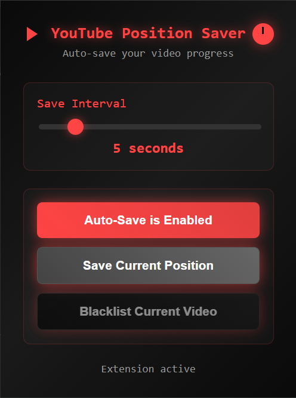

# YouTube Position Saver

A Chrome extension that automatically saves and restores your position in YouTube videos.

Youtube has this feature through watch history, but I find it often doesnt save the exact position or forgets to save at all. So I made this.

## Features

- Lightweight, Only saves positions after 10+ seconds of watch time
- Auto-save video positions at configurable intervals (1-30 seconds)
- Auto-restore timestamp when revisiting videos
- Blacklist specific videos to ignore completely
- Dark theme with 9 color customization options (click the play icon in the title)
- Master power control with toggle
- Manual save button
- All data stored locally

## Installation (it's not an official extension yet.)

1. Go to `chrome://extensions/`
2. Enable "Developer mode"
3. Click "Load unpacked"
4. Select folder