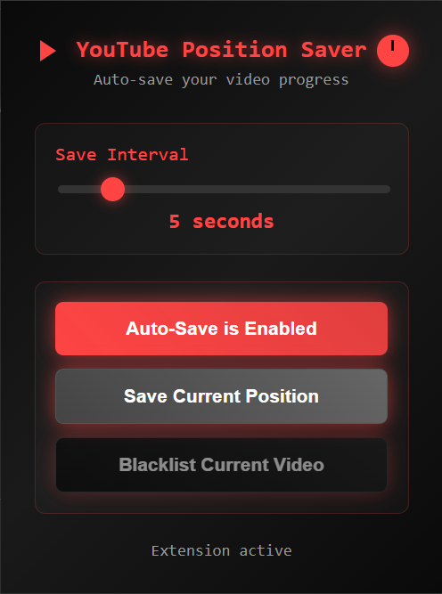

# YouTube Position Saver

A Chrome extension that automatically saves and restores your position in YouTube videos.

YouTube kind of does this through watch history already, but it often misses the exact spot or forgets it completely. This just makes that behavior more reliable.

## Features

- Lightweight
- Only saves positions after 10+ seconds of watch time
- Auto-save video positions at configurable intervals (1-30 seconds)
- Auto-restore timestamp when revisiting videos
- Blacklist specific videos to ignore completely
- Dark theme with 9 color customization options (click the play icon in the title)
- Master power control with toggle
- Manual save button
- All data stored locally

## Installation

This is not on the Chrome Web Store right now.

1. Go to `chrome://extensions/`
2. Enable "Developer mode"
3. Click "Load unpacked"
4. Select this repo folder

## Usage

- Open any YouTube video
- Use the popup to turn the extension on or off
- Set the auto-save interval
- Use the manual save button whenever you want
- Blacklist videos you never want tracked

## Notes

- Saved positions and blacklist data stay local in Chrome storage
- There is no external account setup or API key required
